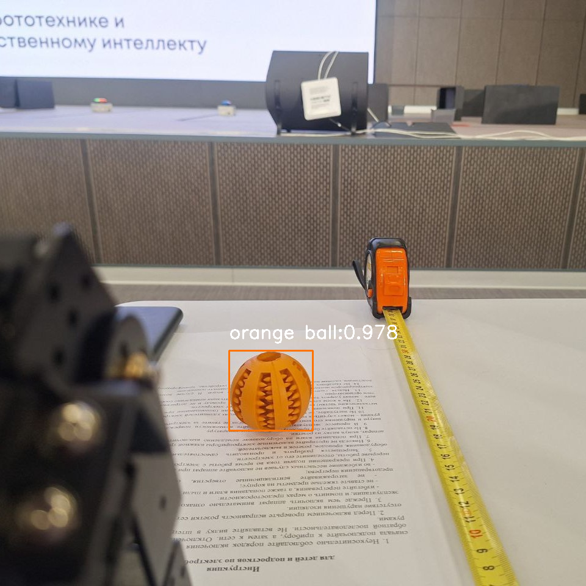
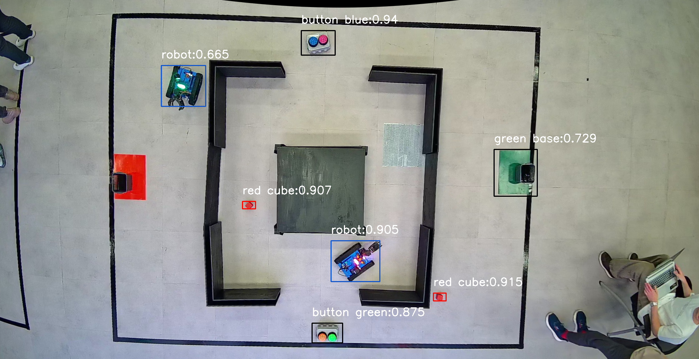

# yandex-stud-camp-24

## Задание
В рамках хакатона необходимо было реализовать управлением роботом, который сможет на основе двух web-камер и набора датчиков построить карту препядствий и в автоматическом режиме перенести объекты к себе на базу, не врезавшись в стены и других роботов

## Структура репозитория
БОльшая часть репозитория содержит код китайских разработчиков робота. Полностью нашей командой были написаны все скрипты в папках *modules*, *experiments* и других. Также во многом претерпели изменения файлы из папки *python_src*, которые непосредственно запускались на роботе

## Яндекс Студкемп
Яндекс Студкемп это очный иненсив по разработке роботов и компьютерному зрению от ведущих экспертов Яндекса, ШАДа и ИРИТ-РТФ УрФУ. Подробнее можно прочитать [тут](https://education.yandex.ru/studcamp-urfu)

## Используемые технологии
Для распознавания объектов были использованы технологии компьютерного зрения (*Python OpenCV*) и нейронная сеть (*YOLO*).

Для построения маршрута было принято решение использовать алгоритм поиска кратчайшего пути *A**. При передвижении и работе с робо-рукой была решена обратная задача кинематики.

Весь код (папка *modules*) организован в виде отдельных классов (с наследованием), которые потом используются в главном скрипте для управления роботом целиком.

### Примеры распознавание
Распознавание оранжевого шарика:

Исправление рыбьего глаза и распознавание основных элементов игрового поля:

